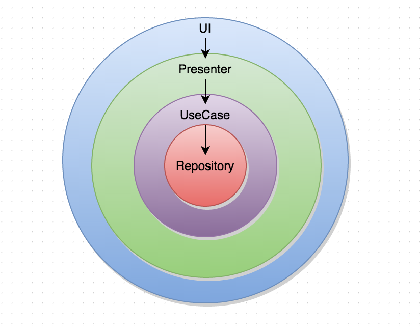
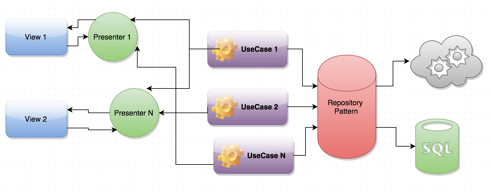

 

A project which showcases usage of Dagger 2, Rxjava and retrolambda among other open source libraries.

# Features
* Model-View-Presenter architectural pattern
* Dagger2
* RxJava + Retrolambda
* Connectivity aware retrofit client
* ErrorHandling
* Uncaught errorhandling
* Navigator to get current activity onscreen
* Snackbar from Design Support Library
* Loading toast progress
* Commons library with a lot of util classes and great 3rd party widgets  

# Overview

This project follows the following principles:  
### SOLID
* Single Responsibility Principle
	* A Class should have only one reason to change.
	* A good separation of responsibilities is done only when the full picture of how the application should work is well understanded.
* Open Close Principle
	* Classes, modules and functions should be open for extension, but closed for modifications.
* Liskov's Substitution Principle
	* Derived types must be completely substitutable for their base types.
	* We must make sure that new derived classes are extending the base classes without changing their behavior.
* Interface Segregation Principle
	* Clients should not be forced to depend upon interfaces that they don't use.
	* If the design is already done fat interfaces can be segregated using the Adapter pattern.
* Dependency Inversion Principle
	* High-level modules should not depend on low-level modules. Both should depend on abstractions. Abstractions should not depend on details. Details should depend on abstractions.

### Repository Pattern

Methods for retrieving domain objects should delegate to a specialized Repository object such that alternative storage implementations may be easily interchanged.

### ResponseMapper

Api models usually different from the domain models. We have to map the response to domain models.

### Interactor

An interactor (or usecase) represents a single use case in the app. It contains the business logit to manipulate model objects (Entities) to carry out a specific task. The work done in an interactor is independent of any type of UI.

### Presenter

Presenters are composed with interactors (usecases) that perform the job in a new thread outside the android UI thread, and come back using a callback with the data that will be rendered in the view.

### View 

The view is going to be abstracted using an interface implemented by android components. The views have different view model.

### RxJava

RxJava is an implementation of the Reactive Extensions (Rx) on the JVM, courtesy of Netflix. Rx was first conceived by Erik Meijer on the Microsoft .NET platform, as a way of combining data or event streams with reactive objects and functional composition. In Rx, events are modeled as observable streams to which observers are subscribed. These streams, or observables for short, can be filtered, transformed, and composed in various ways before their results are emitted to an observer. Every observer is defined within three messages: onNext, onCompleted, and onError. Concurrency is a variable in this equation, and abstracted away in the form of schedulers. Generally, every observable stream exposes an interface that is modeled after concurrent execution flows (i.e. you don’t call it, you subscribe to it), but by default is executed synchronously.

# Useful links

* **Fernando Cejas** [Clean android architecture](http://fernandocejas.com/2014/09/03/architecting-android-the-clean-way/)
* **Dan Lew** [Grokking RxJava](http://blog.danlew.net/2014/09/15/grokking-rxjava-part-1/)
* **Using Rxjava** [Link](https://gist.github.com/vizZ/9756d2e2450a7ef9f744)

